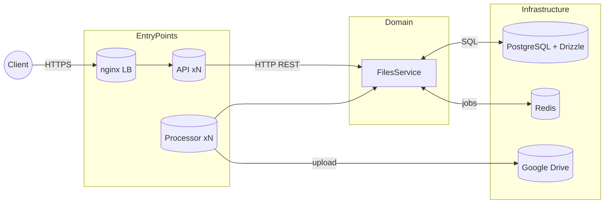

# Files Service

**scalable file upload platform built with Nest.js. + TypeScript, PostgreSQL/DrizzleORM, Redis, BullMQ, Bottleneck, neverthrow and Google Drive API storage integration**

---

## tl;dr

```bash
npm i
cp .env.example .env
docker compose up --scale api=3 --scale processor=3 -d
docker compose exec api npm run db:migrate
```

---

## architecture



* **apps** - `apps/api` (REST) and `apps/processor` (BullMQ consumer) are pure Nest.js modules - they only deal with http-related stuff and user input validation and call domain services.
* **domain layer** - `domain` contains all business logic. They are almost framework‑agnostic (Nest.js DI stuff could be dropped, but I kept it there for the sake of simplicity) and error-prone due to the use of neverthrow, which prevents us from throwing errors at all and makes us handle all the cases as well.
* **infrastructure** - `infra` integrates all external services (DB, Google Drive, Redis, BullMQ, Bottleneck).
* **shared** - env validation, pagination utilities, constants, helpers.

### why it’s flexible

* **storage abstraction** - swap Google Drive for another service by providing a new `StorageProvider` without touching the business code.
* **horizontal scaling** - stateless API & processor nodes let us scale with `docker compose --scale`, while nginx + Docker DNS handle load‑balancing.
* **background queues** - BullMQ lets us handle the file upload in the background, so that the client won't wait minutes for the http request to complete.
* **neverthrow** - literally, never throw ;) it lets us not throw Nest.js exceptions in the domain and pass this work to the API layer which is super-convenient for the framework-agnostic style.
* **pino logger** - a great tool for logs, which keeps them structured, provides them in a JSON format (and does pretty logging for local development) which is highly preferred by many log monitors
* **and... pretty docs** - cool Swagger replacement, just check it out, and you will get it ;)

---

## getting started

### my machine prerequisites

* **Docker 27.4.0** (+ compose)
* **Node.js 24.1.0**

### local setup

1. **env** - copy `.env.example` → `.env` and fill values (Google Drive API service account credentials, and change PostgreSQL/Redis if needed).
2. **stack** - launch: `docker compose up --scale api=3 --scale processor=3 -d`.
3. **migrations** - after Postgres is healthy:

   ```bash
   # from host (uses container network creds)
   docker compose exec api npm run db:migrate
   ```
4. **browse docs** - `http://localhost:3000/docs`.

> **tip**: want to tweak the schema? edit `src/infra/database/schema`, then:
>
> ```bash
> npm run db:generate   # creates migration in /drizzle
> npm run db:migrate    # applies it
> ```
